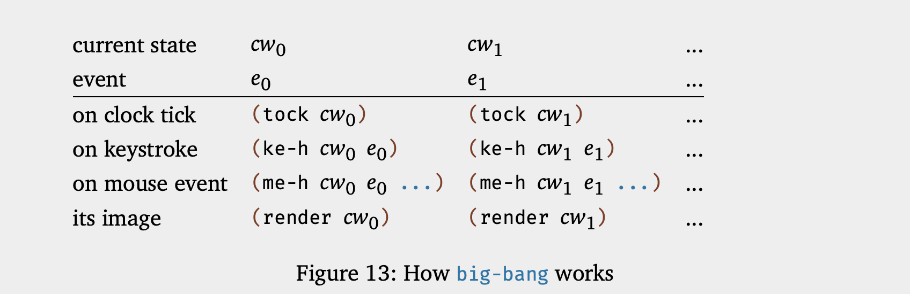

# Fixed-Size Data

## Functions and Programs

### Composing Functions

In general, a program should consist of one function per task and a main
function that puts it all together.

> Define one function per task.

The advantage of following this slogan is that you get reasonably small
functions, each of which is easy to comprehend and whose composition is easy to
understand. Better yet, if you ever need to change a part of the program due to
some change to the problem statement, it tends to be much easier.

### Global Constants

We use uppercase letters for global constants to easily distinguish such
variables from others.

> For every constant mentioned in a problem statement, introduce one constant
> definition.

### Programs

**Interactive Functions**

```Racket
(big-bang cw0
  [on-tick tock]
  [on-key ke-h]
  [on-mouse me-h]
  [to-draw render]
  [stop-when end?]
  ...)
```



## How to Design Programs

A good program comes with a short write-up that explains what it does, what
inputs it expects, and what it produces.

### Designing Functions

**Data Definition** A data definition serves two purposes. First, it names a
collection of data—a class—using a meaningful word. Second, it informs readers
how to create elements of this class and how to decide whether some arbitrary
piece of data belongs to the collection.

```Racket
; A Temperature is a Number. 
; interpretation represents Celsius degrees
```

**The Design Process** Once you understand how to represent input information as
data and to interpret output data as information, the design of an individual
function proceeds according to a straightforward process:

1. Express how you wish to **represent information as data**. A one-line comment
   suffices:

   Formulate data definitions, like the one for Temperature, for the classes of
   data you consider critical for the success of your program.

2. write down a signature, a statement of purpose, and a function header:

   A **function signature** is a comment that tells the readers of your design
   how many inputs your function consumes, from which classes they are drawn,
   and what kind of data it produces.

   ```Racket
   ; Number String Image -> Image
   ```

   A **purpose statement** is a BSL comment that summarizes the purpose of the
   function in a single line. If you are ever in doubt about a purpose
   statement, write down the shortest possible answer to the question _what does
   the function compute?_

   A **header** is a simplistic function definition, also called a stub

   ```Racket
   (define (h num str img) (empty-scene 100 100))
   ```

   Together:

   ```Racket
   ; Number String Image -> Image 
   ; adds s to img,
   ; y pixels from the top and 10 from the left 
   (define (add-image y s img)
     (empty-scene 100 100))
   ```

3. Illustrate the signature and the purpose statement with some **functional
   examples**. You add the examples between the purpose statement and the header
   and get this:

   ```Racket
   ; Number -> Number
   ; computes the area of a square with side len 
   ; given: 2, expect: 4
   ; given: 7, expect: 49
   (define (area-of-square len) 0)
   ```

4. **Take inventory** to understand what are the givens and what we need to
   compute.

   While parameters are placeholders for values that we don’t know yet, we do
   know that it is from this unknown data that the function must compute its
   result. To remind ourselves of this fact, we replace the function’s body with
   a **template**.

   ```Racket
   (define (area-of-square len)
     (... len ...))
   ```

5. It is now time to **code**. To us, coding means to replace the body of the
   function with an expression that attempts to compute from the pieces in the
   template what the purpose statement promises.

   ```Racket
   ; Number String Image -> Image
   ; adds s to img, y pixels from top, 10 pixels to the left
   ; given: 
   ;    5 for y, 
   ;    "hello" for s, and
   ;    (empty-scene 100 100) for img
   ; expected: 
   ;    (place-image (text "hello" 10 "red") 10 5 ...)
   ;    where ... is (empty-scene 100 100)
   (define (add-image y s img)
     (place-image (text s 10 "red") 10 y img))
   ```

6. The last step of a proper design is to **test** the function on the examples
   that you worked out before.

### Domain Knowledge

Since you can never predict the area you will be working in, or which
programming language you will have to use, it is imperative that you have a
solid understanding of the full possibilities of whatever computer languages are
around and suitable. Otherwise some domain expert with half-baked programming
knowledge will take over your job.

### From Functions to Programs

When you have defined global constants, you may wish to add them to your
templates.

We recommend keeping around a list of needed functions or a **wish list**. Each
entry on a wish list should consist of three things: a meaningful name for the
function, a signature, and a purpose statement. For the design of a batch
program, put the main function on the wish list and start designing it. For the
design of an interactive program, you can put the event handlers, the
[stop-when](http://docs.racket-lang.org/teachpack/2htdpuniverse.html#%28form._world._%28%28lib._2htdp%2Funiverse..rkt%29._stop-when%29%29)
function, and the scene-rendering function on the list. As long as the list
isn’t empty, pick a wish and design the function. If you discover during the
design that you need another function, put it on the list. When the list is
empty, you are done.
